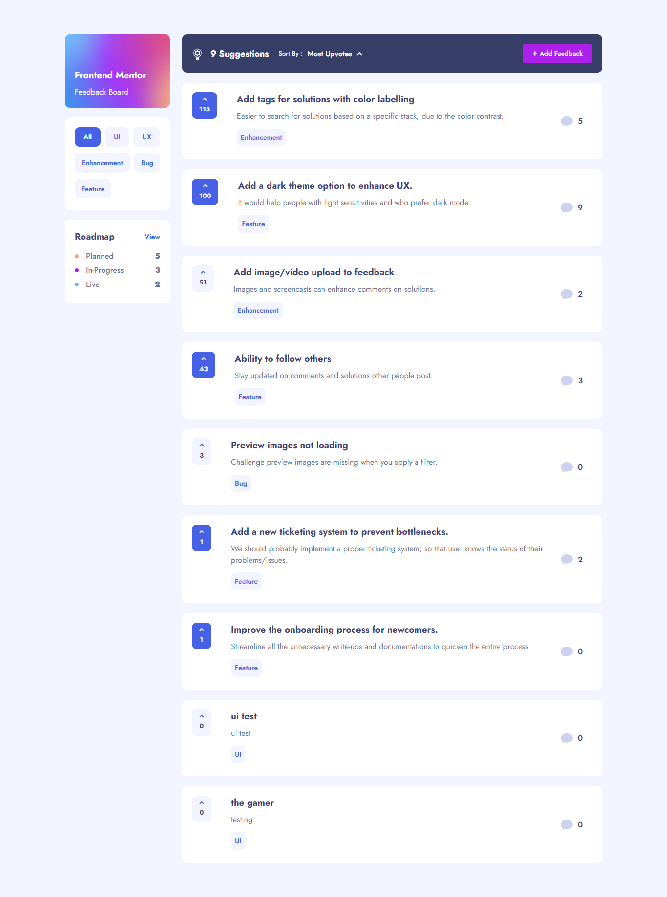

# Frontend Mentor - Product Feedback App solution

This is my solution to the [Product Feedback App challenge on Frontend Mentor](https://www.frontendmentor.io/challenges/product-feedback-app-wbvUYqjR6). Frontend Mentor challenges help you improve your coding skills by building realistic projects.

## Screenshot



## Demo Link

- Live Site URL: [Vercel Live Site Demo]()

## Table of contents

- [Overview](#overview)
  - [The challenge](#the-challenge)
- [My process](#my-process)
  - [Built with](#built-with)
  - [What I learned](#what-i-learned)
  - [Continued development](#continued-development)
  - [Useful resources](#useful-resources)
- [Author](#author)
- [Acknowledgments](#acknowledgments)

## Overview

### The challenge

Users should be able to:

- View the optimal layout for the app depending on their device's screen size
- See hover states for all interactive elements on the page
- Create, read, update, and delete product feedback requests
- Receive form validations when trying to create/edit feedback requests
- Sort suggestions by most/least upvotes and most/least comments
- Filter suggestions by category
- Add comments and replies to a product feedback request
- Upvote product feedback requests
- Bonus: Keep track of any changes, even after refreshing the browser (localStorage could be used for this if you're not building out a full-stack app)

## My process

### Built with

- Semantic HTML5 markup
- CSS custom properties
- Flexbox
- CSS Grid
- [React](https://reactjs.org/) - JS library
- [React Redux](https://react-redux.js.org/) - For global state management in React
- [Redux Thunk](https://github.com/reduxjs/redux-thunk) - To handle asynchronous logic interaction with redux store
- [React Router Dom](https://www.npmjs.com/package/react-router-dom) - To handle routing (dynamic) in React
- [Styled Components](https://styled-components.com/) - For styling and custom props hnadling
- [Framer Motion](https://www.framer.com/motion/) - For micro interaction animations throughout the app

### What I learned

This was a very challenging yet extremely fun project to build. It took me around a month and a week to complete the project in its entirety, including the mobile responsiveness and micro animations. Needless to say, that I have encountered a lot of difficulties (bugs), and I have managed to solve them. Here are some of the things that I learned from this challenge:-

#### Close modal on outside click:-

Initially, I figured that creating a function that set the modal close and attaching it to each and every elements would be an adequate solution. But that would be an arduous and repetitive task, so I set out and look for the most optimal solution and came up with this:

```
    const closeMobileNav = (e) => {
    e.preventDefault();

    ........
    setShowMobile(false);
    document.removeEventListener("click", closeMobileNav);
  };

  const handleMobileNav = (e) => {
    e.stopPropagation();
    e.preventDefault();

    if (showMobile) {
     ..........
      setShowMobile(false);
    } else {
     ..........
      setShowMobile(true);
      document.addEventListener("click", closeMobileNav);
    }
  };
```

Right after, the mobile/modal is clicked open, the handleModal attaches a new event listener with a helper function; one that is intended to close the modal on any click onto the document itself. Thus, simplifies the whole modal closing process.

#### Updating upvote button status and number:-

This was my first time using localStorage, but implementing it in a practical app like this was fortunately a breeze. The one thing that I had trouble when trying to create the functionality to update the upvote status and number was dealing with nested objects. The data (provided in local JSON), has an array with nested objects within it. Hence I find confusing to update the upvote status for each individual feedback without mutating the original data. The solution that I came up with can be seen below:-

```
const handleClick = (e) => {
    e.preventDefault();
    e.stopPropagation();

    if (!upvoteStatus) {
      const updatedData = {
        ...feedbacks,
        productRequests: feedbacks.productRequests.map((feedback) => {
          if (feedback.id === id) {
            return {
              ...feedback,
              upvotes: (feedback.upvotes += 1),
              upvoted: true,
            };
          }
          return { ...feedback };
        }),
      };
      localStorage.setItem("data", JSON.stringify(updatedData));
      dispatch(updateData(updatedData));
      setUpvoteStatus(true);
    }

    if (upvoteStatus) {
      const updatedData = {
        ...feedbacks,
        productRequests: feedbacks.productRequests.map((feedback) => {
          if (feedback.id === id) {
            delete feedback["upvoted"];
            return {
              ...feedback,
              upvotes: (feedback.upvotes -= 1),
            };
          }
          return { ...feedback };
        }),
      };
      localStorage.setItem("data", JSON.stringify(updatedData));
      dispatch(updateData(updatedData));
      setUpvoteStatus(false);
    }
  };
```

First I created a handleClick function that checks whether user has upvoted or not. Within the function itself, I created a new variable to hold the new updated data whenever user clicks on the button (to upvote or to cancel upvote). I used the spread syntax, and mapped through the array, and updated the selected feedback. Then I updated both the localStorage and redux store, so as to sync the data throughout the app.

```
useEffect(() => {
    setFeedbacks(data);

    const extractedData = JSON.parse(localStorage.getItem("data"));

    for (let i = 0; i < extractedData.productRequests.length; i++) {
      // Load number of upvotes from localStorage
      if (extractedData.productRequests[i].id === id) {
        setNumberOfVotes(extractedData.productRequests[i].upvotes);
      }
      // Load upvote status
      if (
        extractedData.productRequests[i].id === id &&
        extractedData.productRequests[i].upvoted === true
      ) {
        setUpvoteStatus(true);
      }
    }
  }, [numberOfVotes, data, id, upvoteStatus]);
```

As for the useEffect, it checks whether user has upvoted when the component initially mounts, and updated the button styling accordingly.

#### Form error handling:-

Form error handling in React is quite different compared to vanilla JS. I did consider of using external libraries such as Formik or React Hook Form, but eventually I settled with writing my own custom error handling as the amount of input elements are negligible. Refer below:-

```
const [errorStatus, setErrorStatus] = useState({
    title: false,
    category: false,
    details: false,
  });

const [formData, setFormData] = useState({
    title: "",
    category: "",
    details: "",
  });

const handleError = (e) => {
    const name = e.target.name;

    if (!formData[name]) {
      setErrorStatus((err) => ({
        ...err,
        [name]: true,
      }));
    } else {
      setErrorStatus((err) => ({
        ...err,
        [name]: false,
      }));
    }
  };

const handleSubmit = (e) => {
    e.preventDefault();

    const keys = Object.keys(formData);

    keys.forEach((key) => {
      if (!formData[key]) {
        setErrorStatus((err) => ({ ...err, [key]: true }));
      }
    });

    ..............
}
```

I first created two state hooks to contain the error status and form data, and another two custom functions to set the error status; both on elements focus out and on submit. Custom messages will appear when user have not entered in any of the input fields, and the styling changes accordingly.
